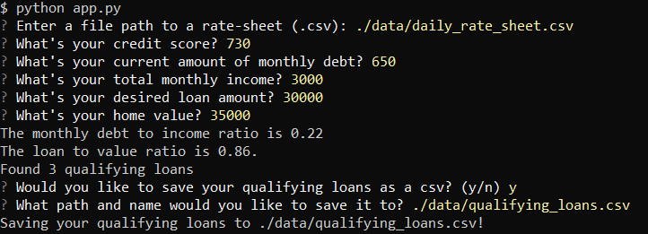

# Loan Qualifier App

This application is designed to show the user the loans that are available to them with certain banks on a list using the loan applicant's credit score, monthly debt, monthly income, the loan amount they need, and the home value.

---

## Technologies

The language of this application is Python. The libraries used are sys, fire, questionary, csv, and from pathlib, Path.

---

## Installation Guide

To install fire and questionary which don't already come with Python, into the terminal with in dev mode, separtely enter these two commands:
`pip install fire` and `pip install questionary`.

---

## Usage

This is how the program should work for the user when ran:

---

## Contributors

Contributor:
Isaiah T Tensae
